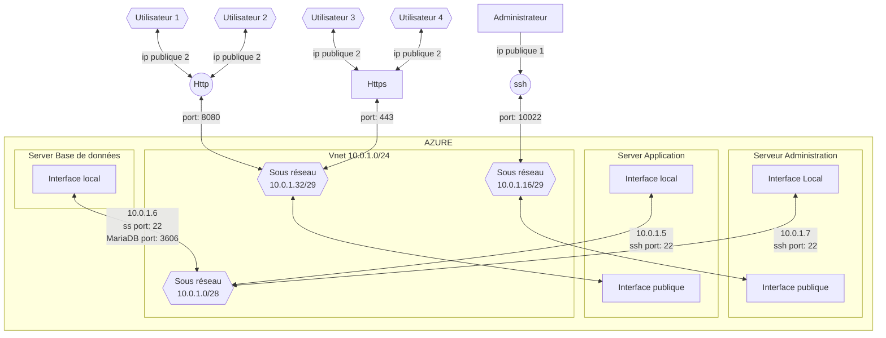

# Brief 2

- [Brief 2](#brief-2)
  * [1 Création du groupe de ressource.](#1-cr-ation-du-groupe-de-ressource)
    + [1.1 Choisir "Groupes de ressources" dans le menu.](#11-choisir--groupes-de-ressources--dans-le-menu)
    + [1.2 Créer le groupe de ressource.](#12-cr-er-le-groupe-de-ressource)
    + [1.3 Définir le nom du groupe et son emplacement géographique.](#13-d-finir-le-nom-du-groupe-et-son-emplacement-g-ographique)
    + [1.4 Valider le groupe de ressource.](#14-valider-le-groupe-de-ressource)
  * [2 Création du réseau virtuel.](#2-cr-ation-du-r-seau-virtuel)
    + [2.1 Choisir "Réseaux virtuels".](#21-choisir--r-seaux-virtuels-)
    + [2.2 Créer le réseaux virtuel.](#22-cr-er-le-r-seaux-virtuel)
    + [2.3 Associer le réseau au groupe de ressource.](#23-associer-le-r-seau-au-groupe-de-ressource)
    + [2.4 Mise en place du réseau "10.0.1.0/24" avec un le sous-réseau "10.0.1.0/28".](#24-mise-en-place-du-r-seau--10010-24--avec-un-le-sous-r-seau--10010-28-)
    + [2.5 Paramètres de sécurités.](#25-param-tres-de-s-curit-s)
    + [2.6 Etiquettes.](#26-etiquettes)
    + [2.7 Vérification du réseau.](#27-v-rification-du-r-seau)
    + [2.8 Création du réseau.](#28-cr-ation-du-r-seau)
  * [3 Création des machines virtuelles.](#3-cr-ation-des-machines-virtuelles)
    + [3.1 Création de la machine virtuelle d'Administration.](#31-cr-ation-de-la-machine-virtuelle-d-administration)
      - [3.1.1 Ouvrir le menu de création de machine virtuelle.](#311-ouvrir-le-menu-de-cr-ation-de-machine-virtuelle)
      - [3.1.2 Définir le nom de la machine virtuelle et attribuer le groupe de ressource auquel elle appartient.](#312-d-finir-le-nom-de-la-machine-virtuelle-et-attribuer-le-groupe-de-ressource-auquel-elle-appartient)
      - [3.1.3 Choisir le type de stockage.](#313-choisir-le-type-de-stockage)
      - [3.1.4 Création de la machine virtuelle.](#314-cr-ation-de-la-machine-virtuelle)
      - [3.1.5 Confirmation du processus du deploiement sur Azure de la machine virtuelle.](#315-confirmation-du-processus-du-deploiement-sur-azure-de-la-machine-virtuelle)
    + [3.2 création de la machine Nextcloud](#32-cr-ation-de-la-machine-nextcloud)
    + [3.3 création de la machine base de donnée](#33-cr-ation-de-la-machine-base-de-donn-e)
  * [4 création des interfaces virtuelles suplémentaires](#4-cr-ation-des-interfaces-virtuelles-supl-mentaires)
    + [4.1 création de l'interface réseau privé de la VM administrateur](#41-cr-ation-de-l-interface-r-seau-priv--de-la-vm-administrateur)
    + [4.2 création de l'interface réseau publique de la VM nextcloud](#42-cr-ation-de-l-interface-r-seau-publique-de-la-vm-nextcloud)
      - [4.2.1 création d'ip publique](#421-cr-ation-d-ip-publique)
      - [4.2.2 création de l'interface](#422-cr-ation-de-l-interface)
      - [4.2.3 connexion des interfaces réseaux](#423-connexion-des-interfaces-r-seaux)
  * [5 configuration des ports](#5-configuration-des-ports)
    + [5.1 modifier le fichier de config ssh](#51-modifier-le-fichier-de-config-ssh)
    + [5.2 modifier les ports dans Azure](#52-modifier-les-ports-dans-azure)
    + [5.3 Configuration des groupes de sécurité](#53-configuration-des-groupes-de-s-curit-)
  * [6 configurer les clés SSH](#6-configurer-les-cl-s-ssh)
    + [6.1 Créer une clé SSH sur linux.](#61-cr-er-une-cl--ssh-sur-linux)
    + [6.2 Envoyer la clé sur la machine virtuelle avec linux.](#62-envoyer-la-cl--sur-la-machine-virtuelle-avec-linux)
    + [6.3 Envoyer la clé sur la machine virtuelle avec Windows et putty.](#63-envoyer-la-cl--sur-la-machine-virtuelle-avec-windows-et-putty)
    + [6.4 Désactiver connexion avec utilisateur et mot de passe.](#64-d-sactiver-connexion-avec-utilisateur-et-mot-de-passe)
    + [6.5 Configurer proxyJump pour se connecter sur les VM application et base de donnée](#65-configurer-proxyjump-pour-se-connecter-sur-les-vm-application-et-base-de-donn-e)
  * [7 Installation de MariaDB sur le serveur base de donnée.](#7-installation-de-mariadb-sur-le-serveur-base-de-donn-e)
    + [7.1 Installation de mariadb-server sur la machine BDD.](#71-installation-de-mariadb-server-sur-la-machine-bdd)
    + [7.2 Configuration de mariadb.](#72-configuration-de-mariadb)
    + [7.3 Connexion à maria-db.](#73-connexion---maria-db)
    + [7.4 Création de la base de donnée nexcloud pour l'application lifesens.](#74-cr-ation-de-la-base-de-donn-e-nexcloud-pour-l-application-lifesens)
    + [7.5 Création de l'utilisateur app pour que l'applcation lifesens puisse accéder à la bdd.](#75-cr-ation-de-l-utilisateur-app-pour-que-l-applcation-lifesens-puisse-acc-der---la-bdd)
    + [7.6 Accéder à la base de donnée nextcloud pour pouvoir attribué des droits.](#76-acc-der---la-base-de-donn-e-nextcloud-pour-pouvoir-attribu--des-droits)
    + [7.7 Priviléges pour nextcloud.](#77-privil-ges-pour-nextcloud)
    + [Configuration de l'adresse ip de maria-db.](#configuration-de-l-adresse-ip-de-maria-db)
  * [8 Installation de php sur le serveur application](#8-installation-de-php-sur-le-serveur-application)
    + [8.1 Installation de php7.4.](#81-installation-de-php74)
  * [9. Nginx](#9-nginx)
    + [9.1 Installation NginX](#91-installation-nginx)
    + [9.2 Désinstallation d'apache.](#92-d-sinstallation-d-apache)
    + [9.3 Configuration Nginx.](#93-configuration-nginx)
  * [10 Nextcloud.](#10-nextcloud)
    + [10.1 Installation.](#101-installation)
    + [10.2 Configuration nextcloud.](#102-configuration-nextcloud)
  * [11 Ajout du disque pour le stockage des données nextcloud.](#11-ajout-du-disque-pour-le-stockage-des-donn-es-nextcloud)
    + [11.1 Afficher la liste des disques.](#111-afficher-la-liste-des-disques)
    + [11.2 Création de la partition.](#112-cr-ation-de-la-partition)
    + [11.3 Création du file system.](#113-cr-ation-du-file-system)
    + [11.4 Montage du disque.](#114-montage-du-disque)
  * [12 Configuration de Nextcloud](#12-configuration-de-nextcloud)
  * [12.1 création d'utilisateur.](#121-cr-ation-d-utilisateur)
  * [13 TLS](#13-tls)
    + [13.1 Installation de snapd.](#131-installation-de-snapd)
    + [13.2 Installation de cerbot.](#132-installation-de-cerbot)
  * [14 Description du système](#14-description-du-syst-me)
    + [14.1 réseau](#141-r-seau)
    + [14.2 ressources serveurs](#142-ressources-serveurs)
    + [14.3 Liste des applications installées.](#143-liste-des-applications-install-es)
      - [14.3.1 Listes des applications sur le serveur admin.](#1431-listes-des-applications-sur-le-serveur-admin)
      - [14.3.2 Listes des applications sur le serveur application.](#1432-listes-des-applications-sur-le-serveur-application)
      - [14.3.3 Liste des applications installées sur le serveur BDD.](#1433-liste-des-applications-install-es-sur-le-serveur-bdd)


## 1 Création du groupe de ressource.
### 1.1 Choisir "Groupes de ressources" dans le menu.


### 1.2 Créer le groupe de ressource.


### 1.3 Définir le nom du groupe et son emplacement géographique.


### 1.4 Valider le groupe de ressource.


## 2 Création du réseau virtuel.

### 2.1 Choisir "Réseaux virtuels".


### 2.2 Créer le réseaux virtuel.


### 2.3 Associer le réseau au groupe de ressource.


### 2.4 Mise en place du réseau "10.0.1.0/24" avec un le sous-réseau "10.0.1.0/28".
* Le masque de sous-réseau fournit 5 IP.

création du réseau en 10.0.1.0/24 avec un sous réseau en 10.0.1.0/28 pour avoir 5 ips disponibles

### 2.5 Paramètres de sécurités.
* Aucun paramètre de sécurité pour le moment.


### 2.6 Etiquettes.
* Aucune étiquette pour le moment.


### 2.7 Vérification du réseau.
* Ne pas oublier la création du réseau après validation.


### 2.8 Création du réseau.


## 3 Création des machines virtuelles.

### 3.1 Création de la machine virtuelle d'Administration.
création d'une machine standard DS1 v2 avec 1 vcpu et 3.5Gio avec Debian 11


#### 3.1.1 Ouvrir le menu de création de machine virtuelle.


* Choisir le type d'identification par "mot de passe", le nom d'utilistateur et le mot de passe.


#### 3.1.2 Définir le nom de la machine virtuelle et attribuer le groupe de ressource auquel elle appartient.


#### 3.1.3 Choisir le type de stockage.
* Dans notre cas un disque dur pour réduire les coûts.
*Modifier l'image*


#### 3.1.4 Création de la machine virtuelle.


#### 3.1.5 Confirmation du processus du deploiement sur Azure de la machine virtuelle.


### 3.2 création de la machine Nextcloud
création d'une machine standard DS3 v2 avec 4 vcpu, 14Gio avec Debian 11
avec un SSD pour L'OS et les application et un Disque dur pour le stockage des données.


### 3.3 création de la machine base de donnée
création d'une machine standard E4BS v5 avec 4 vcpu, 32Gio et Debian 11
Faire attention à ne pas connecter la VM au réseau publique.

## 4 création des interfaces virtuelles suplémentaires
### 4.1 création de l'interface réseau privé de la VM administrateur

accès a la liste des services


accès aux réglages réseaux


puis les réglages d'interfaces réseaux


et enfin on créé une interface


choisir le nom de l'interface, son adresse ip et vérifier le réseau séléctioné.

valider la création de l'interface


### 4.2 création de l'interface réseau publique de la VM nextcloud
#### 4.2.1 création d'ip publique


#### 4.2.2 création de l'interface

voir [4.1_interface privé administrateur](#4.1-création-de-l'interface-réseau-privé-de-la-VM-administrateur)


#### 4.2.3 connexion des interfaces réseaux


dans un premier temps arrêter la VM sur laquelle on souhaite attacher l'interface


attacher une interface

choisir l'interface et valider la séléction

redemarrer la VM.

## 5 configuration des ports
### 5.1 modifier le fichier de config ssh
 
dans un premier temps il faut modifier le fichier config SSH pour configurer le port 10022.

* Ouvrir le fichier sshd_config avec vim.
`sudo vim /etc/ssh/sshd_config`
* changer la ligne:
`#Port 22`
* en:
`Port 10022`
* enregister.

### 5.2 modifier les ports dans Azure
dans les paramètre de la VM/ mise en réseau, supprimer le port à remplacer


cliquer sur "ajouter une régle de port d'entrée"


configurer votre port, le protocole utilisé et le nom du port.


### 5.3 Configuration des groupes de sécurité
Si les paramètres de port de sont pas accessible, il faut configurer le groupe de sécurité (comme ci-dessous)


## 6 configurer les clés SSH
### 6.1 Créer une clé SSH sur linux.
`ssh-keygen -t rsa -b 4096`
`ssh-keygen -t ed25519`


### 6.2 Envoyer la clé sur la machine virtuelle avec linux.
`ssh-copy-id -i [fichier] -p [port] [login]@[ip_adress]`

### 6.3 Envoyer la clé sur la machine virtuelle avec Windows et putty.
* Se connecter avec putty.
* Ouvrir le fichier ~/.ssh/authorized_keys.
* Ajouter la clé générer avec putty.

### 6.4 Désactiver connexion avec utilisateur et mot de passe.
* Ouvrir le fichier de configuration ssh avec vim
`sudo vim /etc/ssh/sshd_config`
* modifier la ligne:
`PasswordAuthentication yes`
* devient :
`PasswordAuthentication no`
* redémarrer le service ssh
`sudo systemctl restart sshd`

### 6.5 Configurer proxyJump pour se connecter sur les VM application et base de donnée
    
* Dans le dossier /home/*utilisateur*/.ssh créer un fichier "config".
`vim /home/utilisateur/.ssh/config
`
* ajouter:
```
Host bastion
	Hostname (ip publique du serveur bastion)
	Port 10022
	User (nom d'utilisateur)
Host bdd
	Hostname (ip local du serveur application)
	User (nom d'utilisateur)
	ProxyJump bastion
Host app
	Hostname (ip local du serveur de la base de donnée)
	User (nom d'utilisateur)
	ProxyJump bastion
```
* Maintenant pour se connecter sur les VM il suffit d'utiliser le nom d'host configurer dans le fichier "config" dans la comande ssh:
exemple: `ssh bdd`

## 7 Installation de MariaDB sur le serveur base de donnée.
### 7.1 Installation de mariadb-server sur la machine BDD.
`sudo apt-get install mariadb-server`
### 7.2 Configuration de mariadb.
* Saisir le mot de passe root de bdd.
* Saisir le mot de passe root de maria-db désiré.
* Supprimer les utilisateurs anonymes.
* Désactiver la connexion à distance pour le root.
* Supprimer la base de donnée test et les accés liés.
* Recharger la table de privilége.
`sudo mysql_secure_installation`

```
NOTE: RUNNING ALL PARTS OF THIS SCRIPT IS RECOMMENDED FOR ALL MariaDB
      SERVERS IN PRODUCTION USE!  PLEASE READ EACH STEP CAREFULLY!

In order to log into MariaDB to secure it, we'll need the current
password for the root user.  If you've just installed MariaDB, and
you haven't set the root password yet, the password will be blank,
so you should just press enter here.

Enter current password for root (enter for none):
OK, successfully used password, moving on...

Setting the root password ensures that nobody can log into the MariaDB
root user without the proper authorisation.

Set root password? [Y/n] Y
New password:
Re-enter new password:
Password updated successfully!
Reloading privilege tables..
 ... Success!


By default, a MariaDB installation has an anonymous user, allowing anyone
to log into MariaDB without having to have a user account created for
them.  This is intended only for testing, and to make the installation
go a bit smoother.  You should remove them before moving into a
production environment.

Remove anonymous users? [Y/n] y
 ... Success!

Normally, root should only be allowed to connect from 'localhost'.  This
ensures that someone cannot guess at the root password from the network.

Disallow root login remotely? [Y/n] y
 ... Success!

By default, MariaDB comes with a database named 'test' that anyone can
access.  This is also intended only for testing, and should be removed
before moving into a production environment.

Remove test database and access to it? [Y/n] y`

 - Dropping test database...
 ... Success!
 - Removing privileges on test database...
 ... Success!

Reloading the privilege tables will ensure that all changes made so far
will take effect immediately.

Reload privilege tables now? [Y/n] y
 ... Success!

Cleaning up...

All done!  If you've completed all of the above steps, your MariaDB
installation should now be secure.

Thanks for using MariaDB!

```


### 7.3 Connexion à maria-db.
`sudo mysql -u root -p`

### 7.4 Création de la base de donnée nexcloud pour l'application lifesens.
`CREATE DATABASE nextcloud;`
* Vérification
`SHOW DATABASES;`

### 7.5 Création de l'utilisateur app pour que l'applcation lifesens puisse accéder à la bdd.
`CREATE USER app@10.0.1.5 IDENTIFIED BY 'meme_password_que_dhab';`

* Vérification
`SELECT Host,User FROM mysql.user;`

### 7.6 Accéder à la base de donnée nextcloud pour pouvoir attribué des droits.
`USE nextcloud`

### 7.7 Priviléges pour nextcloud.
* Donner les priviléges sur l'ensemble de la base de donnée nextcloud pour l'utilisateur app et l'adresse ip 10.0.1.5.
`GRANT ALL PRIVILEGES ON * TO app@10.0.1.5;`

* Mise à jour des priviléges.
`FLUSH PRIVILEGES;`

* Vérification.
`SHOW GRANTS FOR app@10.0.1.5;`

### Configuration de l'adresse ip de maria-db.
* Configuration de maria-db pour qu'il écoute sur la bonne adresse ip.
`sudo vim /etc/mysql/mariadb.conf.d/50-server.cnf`

`bind-adress = 10.0.1.6`

## 8 Installation de php sur le serveur application

### 8.1 Installation de php7.4.
* installation des paquets PHP7.4 ainsi que ses dépendances.

`sudo apt install php7.4 php7.4-cli php7.4-common php7.4-curl php7.4-xml php7.4-gd php7.4-json php7.4-mbstring php7.4-zip php7.4-mysql php7.4-bz2 php7.4-intl php7.4-ldap`

* `php -m` permet d'afficher les modules PHP installés.

*https://docs.nextcloud.com/server/latest/admin_manual/installation/source_installation.html#prerequisites-for-manual-installation*
## 9. Nginx
*https://nginx.org/en/docs/*
*https://docs.nextcloud.com/server/latest/admin_manual/installation/nginx.html#nextcloud-in-the-webroot-of-nginx*


### 9.1 Installation NginX
`sudo apt install nginx`

### 9.2 Désinstallation d'apache.
* Apache est installé par défaut, arrêt d'Apache
`sudo service apache2 stop`
* Désinstallation d'apache.
`sudo apt remove apache2 apache2-data apache2-utils`

### 9.3 Configuration Nginx.
* Création du fichier de configuration de Nginx avec vim.
`sudo vim /etc/nginx/conf.d/nextcloud.conf`

* Configuration pour définir l'IP local,le port et le dossier du serveur 
```
server {
    listen 10.0.1.36:8080;
    root /var/www;
}
```
* Redémarrage du processus de Nginx
`sudo systemctl restart nginx`
* Vérification
`sudo systemctl status nginx.service`

## 10 Nextcloud.

### 10.1 Installation.
* Télécharger le package nextcloud
`sudo wget https://download.nextcloud.com/server/releases/latest.tar.bz2`
* Décompresser le package téléchargé
`sudo bzip2 -d latest.tar.bz2`
* Déconcatèner le fichier ".tar" récupérer.
`sudo tar xvf latest.tar`
* Déplacer le dossier nextcloud dans /var/www
`sudo mv /nextcloud /var/www/nextcloud`

### 10.2 Configuration nextcloud.
* Modifier le fichier /etc/nginx/conf.d/nextcloud.conf
```conf 
server {
	root /var/www/;
        server_name nextcloud-g1.westeurope.cloudapp.azure.com;
	# redirection with regex.
	rewrite  ^/$ http://nextcloud-g1.westeurope.cloudapp.azure.com:80/nextcloud/;
	index index.html index.htm index.php;

	#location ~ \.php$ {
	#	include snippets/fastcgi-php.conf;
	#	fastcgi_pass unix:/var/run/php/php7.4-fpm.sock;
	#	include /etc/nginx/fastcgi_params;
	#	fastcgi_param   SCRIPT_FILENAME  $document_root$fastcgi_script_name;  
	#}

	location ~ /\.ht {
		deny all;
	}
	location ^~ /nextcloud {
# set max upload size
		client_max_body_size 512M;
		fastcgi_buffers 64 4K;

# Enable gzip but do not remove ETag headers
		gzip on;
		gzip_vary on;
		gzip_comp_level 4;
		gzip_min_length 256;
		gzip_proxied expired no-cache no-store private no_last_modified no_etag auth;
		gzip_types application/atom+xml application/javascript application/json application/ld+json application/manifest+json application/rss+xml application/vnd.geo+json application/vnd.ms-fontobject application/x-font-ttf application/x-web-app-manifest+json application/xhtml+xml application/xml font/opentype image/bmp image/svg+xml image/x-icon text/cache-manifest text/css text/plain text/vcard text/vnd.rim.location.xloc text/vtt text/x-component text/x-cross-domain-policy;

# Pagespeed is not supported by Nextcloud, so if your server is built
# with the `ngx_pagespeed` module, uncomment this line to disable it.
#pagespeed off;

# HTTP response headers borrowed from Nextcloud `.htaccess`
		add_header Referrer-Policy                      "no-referrer"   always;
		add_header X-Content-Type-Options               "nosniff"       always;
		add_header X-Download-Options                   "noopen"        always;
		add_header X-Frame-Options                      "SAMEORIGIN"    always;
		add_header X-Permitted-Cross-Domain-Policies    "none"          always;
		add_header X-Robots-Tag                         "none"          always;
		add_header X-XSS-Protection                     "1; mode=block" always;

# Remove X-Powered-By, which is an information leak
		fastcgi_hide_header X-Powered-By;

# Specify how to handle directories -- specifying `/nextcloud/index.php$request_uri`
# here as the fallback means that Nginx always exhibits the desired behaviour
# when a client requests a path that corresponds to a directory that exists
# on the server. In particular, if that directory contains an index.php file,
# that file is correctly served; if it doesn't, then the request is passed to
# the front-end controller. This consistent behaviour means that we don't need
# to specify custom rules for certain paths (e.g. images and other assets,
# `/updater`, `/ocm-provider`, `/ocs-provider`), and thus
# `try_files $uri $uri/ /nextcloud/index.php$request_uri`
# always provides the desired behaviour.
		index index.php index.html /nextcloud/index.php$request_uri;

# Rule borrowed from `.htaccess` to handle Microsoft DAV clients
		location = /nextcloud {
			if ( $http_user_agent ~ ^DavClnt ) {
				return 302 /nextcloud/remote.php/webdav/$is_args$args;
			}
		}

# Rules borrowed from `.htaccess` to hide certain paths from clients
		location ~ ^/nextcloud/(?:build|tests|config|lib|3rdparty|templates|data)(?:$|/)    { return 404; }
		location ~ ^/nextcloud/(?:\.|autotest|occ|issue|indie|db_|console)                  { return 404; }

# Ensure this block, which passes PHP files to the PHP process, is above the blocks
# which handle static assets (as seen below). If this block is not declared first,
# then Nginx will encounter an infinite rewriting loop when it prepends
# `/nextcloud/index.php` to the URI, resulting in a HTTP 500 error response.
		location ~ \.php(?:$|/) {
# Required for legacy support
			rewrite ^/nextcloud/(?!index|remote|public|cron|core\/ajax\/update|status|ocs\/v[12]|updater\/.+|oc[ms]-provider\/.+|.+\/richdocumentscode\/proxy) /nextcloud/index.php$request_uri;

			fastcgi_split_path_info ^(.+?\.php)(/.*)$;
			set $path_info $fastcgi_path_info;

			include snippets/fastcgi-php.conf;
			fastcgi_pass unix:/var/run/php/php7.4-fpm.sock;
			include /etc/nginx/fastcgi_params;
			fastcgi_param   SCRIPT_FILENAME  $document_root$fastcgi_script_name;  
			fastcgi_param modHeadersAvailable true;         # Avoid sending the security headers twice
			fastcgi_param front_controller_active true;     # Enable pretty urls

			fastcgi_intercept_errors on;
			fastcgi_request_buffering off;

			fastcgi_max_temp_file_size 0;
		}

		location ~ \.(?:css|js|svg|gif|map)$ {
			try_files $uri /nextcloud/index.php$request_uri;
			expires 6M;         # Cache-Control policy borrowed from `.htaccess`
				access_log off;     # Optional: Don't log access to assets
		}

		location ~ \.woff2?$ {
			try_files $uri /nextcloud/index.php$request_uri;
			expires 7d;         # Cache-Control policy borrowed from `.htaccess`
				access_log off;     # Optional: Don't log access to assets
		}

# Rule borrowed from `.htaccess`
		location /nextcloud/remote {
			return 301 /nextcloud/remote.php$request_uri;
		}

		location /nextcloud { 
			try_files $uri $uri/ /nextcloud/index.php$request_uri;
		}
	}

    listen 443 ssl; # managed by Certbot
    ssl_certificate /etc/letsencrypt/live/nextcloud-g1.westeurope.cloudapp.azure.com/fullchain.pem; # managed by Certbot
    ssl_certificate_key /etc/letsencrypt/live/nextcloud-g1.westeurope.cloudapp.azure.com/privkey.pem; # managed by Certbot
    include /etc/letsencrypt/options-ssl-nginx.conf; # managed by Certbot
    ssl_dhparam /etc/letsencrypt/ssl-dhparams.pem; # managed by Certbot

}
server {
    if ($host = nextcloud-g1.westeurope.cloudapp.azure.com) {
        return 301 https://$host$request_uri;
    } # managed by Certbot


	listen 10.0.1.36:80;
        server_name nextcloud-g1.westeurope.cloudapp.azure.com;
    return 404; # managed by Certbot


}
server {
	root /var/www/;
	listen 10.0.1.36:8080;
        server_name nextcloud-g1.westeurope.cloudapp.azure.com;
	# redirection with regex.
	rewrite  ^/$ http://nextcloud-g1.westeurope.cloudapp.azure.com:8080/nextcloud/;
	index index.html index.htm index.php;

	#location ~ \.php$ {
	#	include snippets/fastcgi-php.conf;
	#	fastcgi_pass unix:/var/run/php/php7.4-fpm.sock;
	#	include /etc/nginx/fastcgi_params;
	#	fastcgi_param   SCRIPT_FILENAME  $document_root$fastcgi_script_name;  
	#}

	location ~ /\.ht {
		deny all;
	}
	location ^~ /nextcloud {
# set max upload size
		client_max_body_size 512M;
		fastcgi_buffers 64 4K;

# Enable gzip but do not remove ETag headers
		gzip on;
		gzip_vary on;
		gzip_comp_level 4;
		gzip_min_length 256;
		gzip_proxied expired no-cache no-store private no_last_modified no_etag auth;
		gzip_types application/atom+xml application/javascript application/json application/ld+json application/manifest+json application/rss+xml application/vnd.geo+json application/vnd.ms-fontobject application/x-font-ttf application/x-web-app-manifest+json application/xhtml+xml application/xml font/opentype image/bmp image/svg+xml image/x-icon text/cache-manifest text/css text/plain text/vcard text/vnd.rim.location.xloc text/vtt text/x-component text/x-cross-domain-policy;

# Pagespeed is not supported by Nextcloud, so if your server is built
# with the `ngx_pagespeed` module, uncomment this line to disable it.
#pagespeed off;

# HTTP response headers borrowed from Nextcloud `.htaccess`
		add_header Referrer-Policy                      "no-referrer"   always;
		add_header X-Content-Type-Options               "nosniff"       always;
		add_header X-Download-Options                   "noopen"        always;
		add_header X-Frame-Options                      "SAMEORIGIN"    always;
		add_header X-Permitted-Cross-Domain-Policies    "none"          always;
		add_header X-Robots-Tag                         "none"          always;
		add_header X-XSS-Protection                     "1; mode=block" always;

# Remove X-Powered-By, which is an information leak
		fastcgi_hide_header X-Powered-By;

# Specify how to handle directories -- specifying `/nextcloud/index.php$request_uri`
# here as the fallback means that Nginx always exhibits the desired behaviour
# when a client requests a path that corresponds to a directory that exists
# on the server. In particular, if that directory contains an index.php file,
# that file is correctly served; if it doesn't, then the request is passed to
# the front-end controller. This consistent behaviour means that we don't need
# to specify custom rules for certain paths (e.g. images and other assets,
# `/updater`, `/ocm-provider`, `/ocs-provider`), and thus
# `try_files $uri $uri/ /nextcloud/index.php$request_uri`
# always provides the desired behaviour.
		index index.php index.html /nextcloud/index.php$request_uri;

# Rule borrowed from `.htaccess` to handle Microsoft DAV clients
		location = /nextcloud {
			if ( $http_user_agent ~ ^DavClnt ) {
				return 302 /nextcloud/remote.php/webdav/$is_args$args;
			}
		}

# Rules borrowed from `.htaccess` to hide certain paths from clients
		location ~ ^/nextcloud/(?:build|tests|config|lib|3rdparty|templates|data)(?:$|/)    { return 404; }
		location ~ ^/nextcloud/(?:\.|autotest|occ|issue|indie|db_|console)                  { return 404; }

# Ensure this block, which passes PHP files to the PHP process, is above the blocks
# which handle static assets (as seen below). If this block is not declared first,
# then Nginx will encounter an infinite rewriting loop when it prepends
# `/nextcloud/index.php` to the URI, resulting in a HTTP 500 error response.
		location ~ \.php(?:$|/) {
# Required for legacy support
			rewrite ^/nextcloud/(?!index|remote|public|cron|core\/ajax\/update|status|ocs\/v[12]|updater\/.+|oc[ms]-provider\/.+|.+\/richdocumentscode\/proxy) /nextcloud/index.php$request_uri;

			fastcgi_split_path_info ^(.+?\.php)(/.*)$;
			set $path_info $fastcgi_path_info;

			include snippets/fastcgi-php.conf;
			fastcgi_pass unix:/var/run/php/php7.4-fpm.sock;
			include /etc/nginx/fastcgi_params;
			fastcgi_param   SCRIPT_FILENAME  $document_root$fastcgi_script_name;  
			fastcgi_param modHeadersAvailable true;         # Avoid sending the security headers twice
			fastcgi_param front_controller_active true;     # Enable pretty urls

			fastcgi_intercept_errors on;
			fastcgi_request_buffering off;

			fastcgi_max_temp_file_size 0;
		}

		location ~ \.(?:css|js|svg|gif|map)$ {
			try_files $uri /nextcloud/index.php$request_uri;
			expires 6M;         # Cache-Control policy borrowed from `.htaccess`
				access_log off;     # Optional: Don't log access to assets
		}

		location ~ \.woff2?$ {
			try_files $uri /nextcloud/index.php$request_uri;
			expires 7d;         # Cache-Control policy borrowed from `.htaccess`
				access_log off;     # Optional: Don't log access to assets
		}

# Rule borrowed from `.htaccess`
		location /nextcloud/remote {
			return 301 /nextcloud/remote.php$request_uri;
		}

		location /nextcloud { 
			try_files $uri $uri/ /nextcloud/index.php$request_uri;
		}
	}

}


```

* Restart le serveur nginx
`sudo systemctl restart nginx`

* Accorder les droits à nginx:
`chown -R www-data:www:data /var/www/nextcloud`

## 11 Ajout du disque pour le stockage des données nextcloud.
https://geektnt.com/how-to-format-and-mount-second-hard-drive-on-linux.html
### 11.1 Afficher la liste des disques.

* Afficher la liste des disques connectés:
`sudo fdisk -l`
 la commande retourne:
 ```
 Disk /dev/sdb: 30 GiB, 32212254720 bytes, 62914560 sectors
Disk model: Virtual Disk    
Units: sectors of 1 * 512 = 512 bytes
Sector size (logical/physical): 512 bytes / 4096 bytes
I/O size (minimum/optimal): 4096 bytes / 4096 bytes
Disklabel type: gpt
Disk identifier: 56FA86C3-CA7A-FF41-BE04-5BA27EF43A40

Device      Start      End  Sectors  Size Type
/dev/sdb1  262144 62914526 62652383 29.9G Linux filesystem
/dev/sdb14   2048     8191     6144    3M BIOS boot
/dev/sdb15   8192   262143   253952  124M EFI System

Partition table entries are not in disk order.


Disk /dev/sdc: 28 GiB, 30064771072 bytes, 58720256 sectors
Disk model: Virtual Disk    
Units: sectors of 1 * 512 = 512 bytes
Sector size (logical/physical): 512 bytes / 4096 bytes
I/O size (minimum/optimal): 4096 bytes / 4096 bytes
Disklabel type: dos
Disk identifier: 0xdb299023

Device     Boot Start      End  Sectors Size Id Type
/dev/sdc1        2048 58718207 58716160  28G  7 HPFS/NTFS/exFAT


Disk /dev/sda: 32 TiB, 35183298347008 bytes, 68717379584 sectors
Disk model: Virtual Disk    
Units: sectors of 1 * 512 = 512 bytes
Sector size (logical/physical): 512 bytes / 4096 bytes
I/O size (minimum/optimal): 4096 bytes / 4096 bytes
Disklabel type: dos
Disk identifier: 0x9ef47073
```
* On peut remarquer que le dernier disque (sda) peut contenir 32To de données, c'est donc celui que nous avions prévu pour cet usage.

### 11.2 Création de la partition.
* créer une partition avec la commande:
`fdisk /dev/sda`
* Utiliser les commandes suivantes dans le prompt:
– “n” pour une nouvelle partition
– “p” pour une "primary partition"
– “1” pour la première partition
– “Enter” / “Enter” pour le premier et le dernier cylindre (utilise automatiquement l'entièreté du disque)
– “w” pour sauvegarder ce que vous avez fait.

* Ceci aura pour effet de créer une nouvelle partition nommé sda1

### 11.3 Création du file system.
* créer maintenant un file system ex4 sur sda1 avec la commande:
`mkfs.ext4 /dev/sda1`

### 11.4 Montage du disque.
* monter le disque dans le dossier data de nextcloud avec la commande:
`mount /dev/sda1 /var/www/nextcloud/data`

* Vérification.
    * Utiliser la commande `lsblk -f` affiche l'arborescense 


```
NAME    FSTYPE FSVER LABEL UUID                                 FSAVAIL FSUSE% MOUNTPOINT
sda
└─sda1  ext4   1.0         82704436-4b22-4354-a479-c5e0681d9e96    1.9T     0% /var/www/nextcloud/data
sdb
├─sdb1  ext4   1.0         6a14c694-c5a4-4d64-ae61-ce37476808c8   23.4G    15% /
├─sdb14
└─sdb15 vfat   FAT16       B9D4-412C                             117.8M     5% /boot/efi
sdc
└─sdc1  ext4   1.0         8a758f14-41da-4efe-89e1-9f8c556dce26     26G     0% /mnt

```


## 12 Configuration de Nextcloud

* En se connectant au server depuis un navigateur, une page de configuration de nextcloud s'affiche


* configurer le compte administrateurn, le dossier pour les données et la base de donnée et valider.

## 12.1 création d'utilisateur.
* Afin de créer un nouvel utilisateur , ouvrir le menu utilisateur.


* dans le menu utilisateur cliquéer sur nouvel utilisateur


* rentrer les information de l'utilisateur à créer


* valider


## 13 TLS
Nous allons installer Certbot qui est un logiciel gratuit qui permet d'utiliser automatiquement les certificats let's Encrypt.
### 13.1 Installation de snapd.
`sudo apt install snapd`

* installer core qui essentiel a l'utilisation de cerbot en utilisant snap et s'assurer que la dernière version est bien installé.
`sudo snap install core; sudo snap refresh core`

### 13.2 Installation de cerbot.
* installer certbot avec snap
`sudo snap install --classic certbot`

* créer un lien entre les fichier "/snap/bin/certbot" et "/usr/bin/certbot" afin de s'assurer que les commandes cerbot puissent être executé
`sudo ln -s /snap/bin/certbot /usr/bin/certbot`

* ouvrir le fichier "/etc/nginx/conf.d/nextcloud.conf" avec vim
`sudo vim /etc/nginx/conf.d/nextcloud.conf`
* Ajouter la ligne:
`server_name nextcloudg1.westeurope.cloudapp.azure.com/` dans le fichier.

* obtenir une certification et laisser cerbot modifier automatiquement éditerles configurations nginx
`sudo certbot -v --nginx

## 14 Description du système

### 14.1 réseau


### 14.2 ressources serveurs
|     **VMs**      |                          |       **Administrateur**        |         **Application**         |       **Base de Données**       |
|:----------------:|:------------------------:|:-------------------------------:|:-------------------------------:|:-------------------------------:|
| **Nom standard** |                          |             DS1 v2              |             DS3 v2              |             E4BS v5             |
|      **OS**      |                          |           Ubuntu 20.4           |            Debian 11            |            Debian 11            |
|     **CPU**      |                          | Intel(R) Xeon(R) CPU E5-2673 v4 | Intel(R) Xeon(R) Platinum 8171M | Intel(R) Xeon(R) Platinum 8370C |
|                  |     nombre de coeurs     |             1 coeur             |            4 coeurs             |            4 coeurs             |
|                  |         Cadence          |             2.30GHz             |             2.60GHz             |             2.80GHz             |
|     **RAM**      |                          |             3,5Gio              |              14Gio              |              32Gio              |
|   **Réseaux**    |     Nombre de cartes     |        2 cartes réseaux         |        2 cartes réseaux         |         1 carte réseau          |
|                  |         ip local         |           10.0.1.7/28           |           10.0.1.5/28           |           10.0.1.6/28           |
|                  |    Mac (carte local)     |        60:45:bd:8c:5f:2f        |        00:0d:3a:49:e7:d8        |        00:0d:3a:21:5a:f1        |
|                  | ip local carte publique  |          10.0.1.20/29           |          10.0.1.36/29           |               xxx               |
|                  |   Mac (carte publique)   |        60:45:bd:8a:ec:07        |       00:22:48:87\:de:9f        |               xxx               |
|                  |       ip publique        |          20.124.185.97          |          20.119.42.15           |               xxx               |
|                  |           DNS            |           127.0.0.53            |          168.63.129.16          |                                 |
|                  |        Passerelles        |            10.0.1.17            |            10.0.1.33            |               xxx               |
|   **Disques**    |    nombre de disques     |            2 Disques            |            3 Disques            |            2 disques            |
|                  |     Disque principal     |            sda 30Go             |            sdb 30Go             |            sda 30Go             |
|                  |    Disque temporaire     |             sdb 8Go             |            sdc 28Go             |               xxx               |
|                  |    Disque de stockage    |               xxx               |            sda 32To             |               xxx               |
|                  | partition et file system |       *sda1 ext4 26,7Go*        |       *sdb1  ext4 22,5Go*       |       *sda1 ext4 26,4Go*        |
|                  |                          |         *sda14 xxx xxx*         |        *sdb14  xxx xxx*         |         *sda14 xxx xxx*         |
|                  |                          |    *sda15 vfat uefi 99,2Mo*     |       *sdb15 fat16 117Mo*       |      *sda15 fat16 117.8Mo*      |
|                  |                          |         sdb1 ext4 6,4Go         |        *sdc1 ext4 26Go*         |                                 |
|                  |                          |                                 |        *sda1 ext4 1,9To*        |                                 |

### 14.3 Liste des applications installées.

#### 14.3.1 Listes des applications sur le serveur admin.
`ls /usr/bin`
```
 NF                                   fusermount                         ntfs-3g                     sg_write_buffer
 VGAuthService                        fwupdagent                         ntfs-3g.probe               sg_write_long
'['                                   fwupdate                           ntfscat                     sg_write_same
 aa-enabled                           fwupdmgr                           ntfscluster                 sg_write_verify
 aa-exec                              fwupdtool                          ntfscmp                     sg_write_x
 acpidbg                              gapplication                       ntfsdecrypt                 sg_xcopy
 add-apt-repository                   gawk                               ntfsfallocate               sg_zone
 addpart                              gdbus                              ntfsfix                     sginfo
 apport-bug                           geqn                               ntfsinfo                    sgm_dd
 apport-cli                           getcifsacl                         ntfsls                      sgp_dd
 apport-collect                       getconf                            ntfsmove                    sh
 apport-unpack                        getent                             ntfsrecover                 sha1sum
 apropos                              getkeycodes                        ntfssecaudit                sha224sum
 apt                                  getopt                             ntfstruncate                sha256sum
 apt-add-repository                   gettext                            ntfsusermap                 sha384sum
 apt-cache                            gettext.sh                         ntfswipe                    sha512sum
 apt-cdrom                            ginstall-info                      numfmt                      shasum
 apt-config                           gio                                od                          showconsolefont
 apt-extracttemplates                 gio-querymodules                   oem-getlogs                 showkey
 apt-ftparchive                       git                                on_ac_power                 shred
 apt-get                              git-receive-pack                   openssl                     shuf
 apt-key                              git-shell                          openvt                      skill
 apt-mark                             git-upload-archive                 os-prober                   slabtop
 apt-sortpkgs                         git-upload-pack                    pager                       sleep
 arch                                 glib-compile-schemas               partx                       slogin
 at                                   gpasswd                            passwd                      smbinfo
 atq                                  gpg                                paste                       snap
 atrm                                 gpg-agent                          pastebinit                  snapctl
 automat-visualize3                   gpg-connect-agent                  patch                       snapfuse
 awk                                  gpg-wks-server                     pathchk                     snice
 b2sum                                gpg-zip                            pbget                       soelim
 base32                               gpgcompose                         pbput                       sort
 base64                               gpgconf                            pbputs                      sos
 basename                             gpgparsemail                       pdb3                        sos-collector
 bash                                 gpgsm                              pdb3.8                      sosreport
 bashbug                              gpgsplit                           peekfd                      splain
 batch                                gpgtar                             perf                        split
 bc                                   gpgv                               perl                        splitfont
 boltctl                              gpic                               perl5.30-x86_64-linux-gnu   ss
 bootctl                              grep                               perl5.30.0                  ssh
 bsd-from                             gresource                          perlbug                     ssh-add
 bsd-write                            groff                              perldoc                     ssh-agent
 btrfs                                grog                               perlivp                     ssh-argv0
 btrfs-convert                        grops                              perlthanks                  ssh-copy-id
 btrfs-find-root                      grotty                             pftp                        ssh-import-id
 btrfs-image                          groups                             pgrep                       ssh-import-id-gh
 btrfs-map-logical                    growpart                           pic                         ssh-import-id-lp
 btrfs-select-super                   grub-editenv                       pico                        ssh-keygen
 btrfsck                              grub-file                          piconv                      ssh-keyscan
 btrfstune                            grub-fstest                        pidof                       stat
 bunzip2                              grub-glue-efi                      pinentry                    static-sh
 busctl                               grub-kbdcomp                       pinentry-curses             stdbuf
 busybox                              grub-menulst2cfg                   ping                        strace
 byobu                                grub-mkfont                        ping4                       strace-log-merge
 byobu-config                         grub-mkimage                       ping6                       stty
 byobu-ctrl-a                         grub-mklayout                      pinky                       su
 byobu-disable                        grub-mknetdir                      pkaction                    sudo
 byobu-disable-prompt                 grub-mkpasswd-pbkdf2               pkcheck                     sudoedit
 byobu-enable                         grub-mkrelpath                     pkcon                       sudoreplay
 byobu-enable-prompt                  grub-mkrescue                      pkexec                      sum
 byobu-export                         grub-mkstandalone                  pkill                       symcryptrun
 byobu-janitor                        grub-mount                         pkmon                       sync
 byobu-keybindings                    grub-ntldr-img                     pkttyagent                  systemctl
 byobu-launch                         grub-render-label                  pl2pm                       systemd
 byobu-launcher                       grub-script-check                  pldd                        systemd-analyze
 byobu-launcher-install               grub-syslinux2cfg                  plymouth                    systemd-ask-password
 byobu-launcher-uninstall             gsettings                          pmap                        systemd-cat
 byobu-layout                         gtbl                               pod2html                    systemd-cgls
 byobu-prompt                         gunzip                             pod2man                     systemd-cgtop
 byobu-quiet                          gzexe                              pod2text                    systemd-delta
 byobu-reconnect-sockets              gzip                               pod2usage                   systemd-detect-virt
 byobu-screen                         h2ph                               podchecker                  systemd-escape
 byobu-select-backend                 h2xs                               podselect                   systemd-hwdb
 byobu-select-profile                 hd                                 pollinate                   systemd-id128
 byobu-select-session                 head                               pr                          systemd-inhibit
 byobu-shell                          helpztags                          preconv                     systemd-machine-id-setup
 byobu-silent                         hexdump                            print                       systemd-mount
 byobu-status                         host                               printenv                    systemd-notify
 byobu-status-detail                  hostid                             printerbanner               systemd-path
 byobu-tmux                           hostname                           printf                      systemd-resolve
 byobu-ugraph                         hostnamectl                        prlimit                     systemd-run
 byobu-ulevel                         htop                               prove                       systemd-socket-activate
 bzcat                                hwe-support-status                 prtstat                     systemd-stdio-bridge
 bzcmp                                i386                               ps                          systemd-sysusers
 bzdiff                               iconv                              psfaddtable                 systemd-tmpfiles
 bzegrep                              id                                 psfgettable                 systemd-tty-ask-password-agent
 bzexe                                info                               psfstriptable               systemd-umount
 bzfgrep                              infobrowser                        psfxtable                   tabs
 bzgrep                               infocmp                            pslog                       tac
 bzip2                                infotocap                          pstree                      tail
 bzip2recover                         install                            pstree.x11                  tar
 bzless                               install-info                       ptar                        taskset
 bzmore                               instmodsh                          ptardiff                    tbl
 c_rehash                             ionice                             ptargrep                    tee
 cal                                  ip                                 ptx                         telnet
 calendar                             ipcmk                              purge-old-kernels           telnet.netkit
 captoinfo                            ipcrm                              pwd                         tempfile
 cat                                  ipcs                               pwdx                        test
 catchsegv                            iptables-xml                       py3clean                    tic
 catman                               ischroot                           py3compile                  time
 cautious-launcher                    iscsiadm                           py3versions                 timedatectl
 cftp3                                join                               pydoc3                      timeout
 chage                                journalctl                         pydoc3.8                    tkconch3
 chardet3                             json_pp                            pygettext3                  tload
 chardetect3                          jsondiff                           pygettext3.8                tmux
 chattr                               jsonpatch                          pyhtmlizer3                 toe
 chcon                                jsonpatch-jsondiff                 pyjwt3                      top
 check-language-support               jsonpointer                        python3                     touch
 chfn                                 jsonschema                         python3.8                   tput
 chgrp                                kbd_mode                           rbash                       tr
 chmod                                kbdinfo                            rcp                         tracepath
 choom                                kbxutil                            rdma                        traceproto
 chown                                keep-one-running                   readlink                    traceproto.db
 chronyc                              kernel-install                     realpath                    traceroute
 chrt                                 keyctl                             red                         traceroute-nanog
 chsh                                 keyring                            rename.ul                   traceroute.db
 chvt                                 kill                               renice                      traceroute6
 cifscreds                            killall                            rescan-scsi-bus.sh          traceroute6.db
 ckbcomp                              kmod                               reset                       traceroute6.iputils
 ckeygen3                             kmodsign                           resizecons                  trial3
 cksum                                landscape-sysinfo                  resizepart                  troff
 clear                                last                               resolvectl                  true
 clear_console                        lastb                              rev                         truncate
 cloud-id                             lastlog                            rgrep                       tset
 cloud-init                           lcf                                rlogin                      tsort
 cloud-init-per                       ldd                                rm                          tty
 cmp                                  less                               rmdir                       turbostat
 codepage                             lessecho                           rnano                       twist3
 col                                  lessfile                           routef                      twistd3
 col1                                 lesskey                            routel                      tzselect
 col2                                 lesspipe                           rrsync                      ua
 col3                                 lexgrog                            rsh                         ubuntu-advantage
 col4                                 lft                                rsync                       ubuntu-bug
 col5                                 lft.db                             rtstat                      ubuntu-core-launcher
 col6                                 libnetcfg                          run-mailcap                 ubuntu-distro-info
 col7                                 link                               run-one                     ubuntu-security-status
 col8                                 linux-boot-prober                  run-one-constantly          ucf
 col9                                 linux-check-removal                run-one-until-failure       ucfq
 colcrt                               linux-update-symlinks              run-one-until-success       ucfr
 colrm                                linux-version                      run-parts                   udevadm
 column                               linux32                            run-this-one                udisksctl
 comm                                 linux64                            runcon                      ul
 compose                              ln                                 rview                       ulockmgr_server
 conch3                               lnstat                             rvim                        umount
 corelist                             loadkeys                           savelog                     uname
 cp                                   loadunimap                         sbattach                    unattended-upgrade
 cpan                                 locale                             sbkeysync                   unattended-upgrades
 cpan5.30-x86_64-linux-gnu            locale-check                       sbsiglist                   uncompress
 cpio                                 localectl                          sbsign                      unexpand
 cpupower                             localedef                          sbvarsign                   unicode_start
 crontab                              logger                             sbverify                    unicode_stop
 csplit                               login                              scp                         uniq
 ctail                                loginctl                           screen                      unlink
 ctstat                               logname                            screendump                  unlz4
 curl                                 look                               script                      unlzma
 cut                                  lorder                             scriptreplay                unmkinitramfs
 cvtsudoers                           lowntfs-3g                         scsi_logging_level          unshare
 dash                                 ls                                 scsi_mandat                 unsquashfs
 date                                 lsattr                             scsi_readcap                unxz
 dbus-cleanup-sockets                 lsb_release                        scsi_ready                  update-alternatives
 dbus-daemon                          lsblk                              scsi_satl                   update-mime-database
 dbus-monitor                         lscpu                              scsi_start                  uptime
 dbus-run-session                     lshw                               scsi_stop                   usb-devices
 dbus-send                            lsinitramfs                        scsi_temperature            usbhid-dump
 dbus-update-activation-environment   lsipc                              sdiff                       usbip
 dbus-uuidgen                         lslocks                            sed                         usbipd
 dbxtool                              lslogins                           see                         usbreset
 dd                                   lsmem                              select-editor               users
 deallocvt                            lsmod                              sensible-browser            utmpdump
 deb-systemd-helper                   lsns                               sensible-editor             uuidgen
 deb-systemd-invoke                   lsof                               sensible-pager              uuidparse
 debconf                              lspci                              seq                         vcs-run
 debconf-apt-progress                 lspgpot                            setarch                     vdir
 debconf-communicate                  lsscsi                             setcifsacl                  vi
 debconf-copydb                       lsusb                              setfont                     view
 debconf-escape                       ltrace                             setkeycodes                 vigpg
 debconf-set-selections               lz4                                setleds                     vim
 debconf-show                         lz4c                               setlogcons                  vim.basic
 debian-distro-info                   lz4cat                             setmetamode                 vim.tiny
 delpart                              lzcat                              setpci                      vimdiff
 delv                                 lzcmp                              setpriv                     vimtutor
 df                                   lzdiff                             setsid                      vmhgfs-fuse
 dfu-tool                             lzegrep                            setterm                     vmstat
 dh_bash-completion                   lzfgrep                            setupcon                    vmtoolsd
 diff                                 lzgrep                             sftp                        vmware-checkvm
 diff3                                lzless                             sg                          vmware-hgfsclient
 dig                                  lzma                               sg_bg_ctl                   vmware-namespace-cmd
 dir                                  lzmainfo                           sg_compare_and_write        vmware-rpctool
 dircolors                            lzmore                             sg_copy_results             vmware-toolbox-cmd
 dirmngr                              mailmail3                          sg_dd                       vmware-vgauth-cmd
 dirmngr-client                       man                                sg_decode_sense             vmware-vgauth-smoketest
 dirname                              man-recode                         sg_emc_trespass             vmware-vmblock-fuse
 distro-info                          mandb                              sg_format                   vmware-xferlogs
 dmesg                                manifest                           sg_get_config               volname
 dnsdomainname                        manpath                            sg_get_lba_status           w
 do-release-upgrade                   mapscrn                            sg_ident                    w.procps
 domainname                           mawk                               sg_inq                      wall
 dpkg                                 mcookie                            sg_logs                     watch
 dpkg-deb                             md5sum                             sg_luns                     watchgnupg
 dpkg-divert                          md5sum.textutils                   sg_map                      wc
 dpkg-maintscript-helper              mdig                               sg_map26                    wdctl
 dpkg-query                           mesg                               sg_modes                    wget
 dpkg-split                           migrate-pubring-from-classic-gpg   sg_opcodes                  whatis
 dpkg-statoverride                    miniterm                           sg_persist                  whereis
 dpkg-trigger                         mk_modmap                          sg_prevent                  which
 du                                   mkdir                              sg_raw                      whiptail
 dumpkeys                             mkfifo                             sg_rbuf                     who
 eatmydata                            mknod                              sg_rdac                     whoami
 ec2metadata                          mksquashfs                         sg_read                     wifi-status
 echo                                 mktemp                             sg_read_attr                write
 ed                                   mmcli                              sg_read_block_limits        x86_64
 edit                                 mokutil                            sg_read_buffer              x86_energy_perf_policy
 editor                               more                               sg_read_long                xargs
 efibootdump                          mount                              sg_readcap                  xauth
 efibootmgr                           mountpoint                         sg_reassign                 xdg-user-dir
 egrep                                mt                                 sg_referrals                xdg-user-dirs-update
 eject                                mt-gnu                             sg_rep_zones                xsubpp
 enc2xs                               mtr                                sg_requests                 xxd
 encguess                             mtr-packet                         sg_reset                    xz
 env                                  mv                                 sg_reset_wp                 xzcat
 envsubst                             namei                              sg_rmsn                     xzcmp
 eqn                                  nano                               sg_rtpg                     xzdiff
 ex                                   nawk                               sg_safte                    xzegrep
 expand                               nc                                 sg_sanitize                 xzfgrep
 expiry                               nc.openbsd                         sg_sat_identify             xzgrep
 expr                                 ncal                               sg_sat_phy_event            xzless
 factor                               neqn                               sg_sat_read_gplog           xzmore
 faillog                              netcat                             sg_sat_set_features         yes
 fallocate                            netkit-ftp                         sg_scan                     ypdomainname
 false                                netstat                            sg_seek                     zcat
 fgconsole                            networkctl                         sg_senddiag                 zcmp
 fgrep                                networkd-dispatcher                sg_ses                      zdiff
 file                                 newgrp                             sg_ses_microcode            zdump
 finalrd                              ngettext                           sg_start                    zegrep
 fincore                              nice                               sg_stpg                     zfgrep
 find                                 nisdomainname                      sg_stream_ctl               zforce
 findmnt                              nl                                 sg_sync                     zgrep
 flock                                nohup                              sg_test_rwbuf               zipdetails
 fmt                                  nproc                              sg_timestamp                zless
 fold                                 nroff                              sg_turs                     zmore
 free                                 nsenter                            sg_unmap                    znew
 from                                 nslookup                           sg_verify
 ftp                                  nstat                              sg_vpd
 fuser                                nsupdate                           sg_wr_mode
```

`ls /usr/sbin`

``` 
ModemManager           ebtables-nft-save            iptables-nft                nfnl_osf               thin_rmap
aa-remove-unknown      ebtables-restore             iptables-nft-restore        nologin                thin_trim
aa-status              ebtables-save                iptables-nft-save           ntfsclone              tipc
aa-teardown            ephemeral-disk-warning       iptables-restore            ntfscp                 traceroute
accessdb               era_check                    iptables-restore-translate  ntfslabel              tune2fs
add-shell              era_dump                     iptables-save               ntfsresize             tzconfig
addgnupghome           era_invalidate               iptables-translate          ntfsundelete           ufw
addgroup               era_restore                  iptunnel                    on_ac_power            umount.udisks2
adduser                ethtool                      irqbalance                  overlayroot-chroot     unix_chkpwd
agetty                 faillock                     irqbalance-ui               ownership              unix_update
apparmor_parser        fatlabel                     iscsi-iname                 pam-auth-update        update-ca-certificates
apparmor_status        fdformat                     iscsi_discovery             pam_extrausers_chkpwd  update-grub
applygnupgdefaults     fdisk                        iscsiadm                    pam_extrausers_update  update-grub-gfxpayload
arp                    filefrag                     iscsid                      pam_getenv             update-grub2
arpd                   findfs                       iscsistart                  pam_tally              update-info-dir
arptables              fixparts                     isosize                     pam_tally2             update-initramfs
arptables-nft          fsadm                        kbdrate                     pam_timestamp_check    update-locale
arptables-nft-restore  fsck                         key.dns_resolver            parted                 update-mime
arptables-nft-save     fsck.btrfs                   killall5                    partprobe              update-passwd
arptables-restore      fsck.cramfs                  kpartx                      pdata_tools            update-pciids
arptables-save         fsck.ext2                    ldattach                    pivot_root             update-rc.d
atd                    fsck.ext3                    ldconfig                    plipconfig             update-secureboot-policy
badblocks              fsck.ext4                    ldconfig.real               plymouthd              upgrade-from-grub-legacy
bcache-super-show      fsck.fat                     locale-gen                  popcon-largest-unused  usb_modeswitch
biosdecode             fsck.minix                   logrotate                   popularity-contest     usb_modeswitch_dispatcher
blkdeactivate          fsck.msdos                   logsave                     poweroff               useradd
blkdiscard             fsck.vfat                    losetup                     pvchange               userdel
blkid                  fsck.xfs                     lsmod                       pvck                   usermod
blkzone                fsfreeze                     lsvmbus                     pvcreate               uuidd
blockdev               fstab-decode                 luksformat                  pvdisplay              validlocale
bpftool                fstrim                       lvchange                    pvmove                 vcstime
bridge                 gdisk                        lvconvert                   pvremove               veritysetup
cache_check            genl                         lvcreate                    pvresize               vgcfgbackup
cache_dump             getcap                       lvdisplay                   pvs                    vgcfgrestore
cache_metadata_size    getpcaps                     lvextend                    pvscan                 vgchange
cache_repair           getty                        lvm                         pwck                   vgck
cache_restore          groupadd                     lvmconfig                   pwconv                 vgconvert
cache_writeback        groupdel                     lvmdiskscan                 pwunconv               vgcreate
capsh                  groupmems                    lvmdump                     rarp                   vgdisplay
cfdisk                 groupmod                     lvmpolld                    raw                    vgexport
cgdisk                 grpck                        lvmsadc                     readprofile            vgextend
chcpu                  grpconv                      lvmsar                      reboot                 vgimport
chgpasswd              grpunconv                    lvreduce                    remove-shell           vgimportclone
chmem                  grub-bios-setup              lvremove                    request-key            vgmerge
chpasswd               grub-install                 lvrename                    resize2fs              vgmknodes
chronyd                grub-macbless                lvresize                    rmmod                  vgreduce
chroot                 grub-mkconfig                lvs                         rmt                    vgremove
cifs.idmap             grub-mkdevicemap             lvscan                      rmt-tar                vgrename
cifs.upcall            grub-probe                   make-bcache                 route                  vgs
cpgr                   grub-reboot                  mdadm                       rsyslogd               vgscan
cppw                   grub-set-default             mdmon                       rtacct                 vgsplit
cron                   halt                         mii-tool                    rtcwake                vigr
cryptdisks_start       hdparm                       mkdosfs                     rtmon                  vipw
cryptdisks_stop        hv_fcopy_daemon              mke2fs                      runlevel               visudo
cryptsetup             hv_get_dhcp_info             mkfs                        runuser                vpddecode
cryptsetup-reencrypt   hv_get_dns_info              mkfs.bfs                    scxadmin               waagent
ctrlaltdel             hv_kvp_daemon                mkfs.btrfs                  service                waagent2.0
debugfs                hv_set_ifconfig              mkfs.cramfs                 setcap                 wipefs
delgroup               hv_vss_daemon                mkfs.ext2                   setvesablank           xfs_admin
deluser                hwclock                      mkfs.ext3                   setvtrgb               xfs_bmap
depmod                 iconvconfig                  mkfs.ext4                   sfdisk                 xfs_copy
devlink                ifconfig                     mkfs.fat                    sgdisk                 xfs_db
dhclient               init                         mkfs.minix                  shadowconfig           xfs_estimate
dhclient-script        insmod                       mkfs.msdos                  shutdown               xfs_freeze
dmeventd               installkernel                mkfs.ntfs                   slattach               xfs_fsr
dmidecode              integritysetup               mkfs.vfat                   sshd                   xfs_growfs
dmsetup                invoke-rc.d                  mkfs.xfs                    start-stop-daemon      xfs_info
dmstats                ip                           mkhomedir_helper            sulogin                xfs_io
dosfsck                ip6tables                    mkinitramfs                 swaplabel              xfs_logprint
dosfslabel             ip6tables-apply              mklost+found                swapoff                xfs_mdrestore
dpkg-preconfigure      ip6tables-legacy             mkntfs                      swapon                 xfs_metadump
dpkg-reconfigure       ip6tables-legacy-restore     mkswap                      switch_root            xfs_mkfile
dumpe2fs               ip6tables-legacy-save        modinfo                     sysctl                 xfs_ncheck
e2freefrag             ip6tables-nft                modprobe                    tarcat                 xfs_quota
e2fsck                 ip6tables-nft-restore        mount.cifs                  tc                     xfs_repair
e2image                ip6tables-nft-save           mount.fuse                  tcpdump                xfs_rtcp
e2label                ip6tables-restore            mount.lowntfs-3g            tcptraceroute          xfs_scrub
e2mmpstatus            ip6tables-restore-translate  mount.ntfs                  tcptraceroute.db       xfs_scrub_all
e2scrub                ip6tables-save               mount.ntfs-3g               telinit                xfs_spaceman
e2scrub_all            ip6tables-translate          mount.vmhgfs                thin_check             xtables-legacy-multi
e2undo                 ipmaddr                      mpathpersist                thin_delta             xtables-monitor
e4crypt                iptables                     multipath                   thin_dump              xtables-nft-multi
e4defrag               iptables-apply               multipathd                  thin_ls                zerofree
ebtables               iptables-legacy              nameif                      thin_metadata_size     zic
ebtables-nft           iptables-legacy-restore      netplan                     thin_repair            zramctl
ebtables-nft-restore   iptables-legacy-save         newusers                    thin_restore
``` 
#### 14.3.2 Listes des applications sur le serveur application.
`ls /usr/bin`
```
 GET                                  gettext                            mokutil                     ss
 HEAD                                 gettext.sh                         more                        ssh
 POST                                 gfix                               mount                       ssh-add
 X11                                  ghostscript                        mount-image-callback        ssh-agent
'['                                   gpasswd                            mountpoint                  ssh-argv0
 aa-enabled                           gpg                                mt                          ssh-copy-id
 aa-exec                              gpg-agent                          mt-gnu                      ssh-keygen
 addpart                              gpg-connect-agent                  mv                          ssh-keyscan
 ant                                  gpg-wks-server                     namei                       stat
 appres                               gpg-zip                            nano                        stdbuf
 apropos                              gpgcompose                         nawk                        streamzip
 apt                                  gpgconf                            nbackup                     stty
 apt-cache                            gpgparsemail                       neqn                        su
 apt-cdrom                            gpgsm                              netstat                     sudo
 apt-config                           gpgsplit                           networkctl                  sudoedit
 apt-extracttemplates                 gpgtar                             newgrp                      sudoreplay
 apt-ftparchive                       gpgv                               ngettext                    sum
 apt-get                              gpic                               nice                        sync
 apt-key                              gpre                               nisdomainname               systemctl
 apt-listchanges                      grep                               nl                          systemd
 apt-mark                             groff                              nohup                       systemd-analyze
 apt-sortpkgs                         grog                               nproc                       systemd-ask-password
 arch                                 grops                              nroff                       systemd-cat
 awk                                  grotty                             nsenter                     systemd-cgls
 b2sum                                groups                             nstat                       systemd-cgtop
 base32                               growpart                           numfmt                      systemd-delta
 base64                               grub-editenv                       od                          systemd-detect-virt
 basename                             grub-file                          open                        systemd-escape
 basenc                               grub-fstest                        openssl                     systemd-hwdb
 bash                                 grub-glue-efi                      pack200                     systemd-id128
 bashbug                              grub-kbdcomp                       pager                       systemd-inhibit
 bootctl                              grub-menulst2cfg                   paperconf                   systemd-machine-id-setup
 broadwayd                            grub-mkfont                        partx                       systemd-mount
 bunzip2                              grub-mkimage                       passwd                      systemd-notify
 busctl                               grub-mklayout                      paste                       systemd-path
 bzcat                                grub-mknetdir                      pathchk                     systemd-resolve
 bzcmp                                grub-mkpasswd-pbkdf2               pdb3                        systemd-run
 bzdiff                               grub-mkrelpath                     pdb3.9                      systemd-socket-activate
 bzegrep                              grub-mkrescue                      pdf2dsc                     systemd-stdio-bridge
 bzexe                                grub-mkstandalone                  pdf2ps                      systemd-sysusers
 bzfgrep                              grub-mount                         peekfd                      systemd-tmpfiles
 bzgrep                               grub-render-label                  perf                        systemd-tty-ask-password-agent
 bzip2                                grub-script-check                  perl                        systemd-umount
 bzip2recover                         grub-syslinux2cfg                  perl5.32-x86_64-linux-gnu   tabs
 bzless                               gs                                 perl5.32.1                  tac
 bzmore                               gsbj                               perlbug                     tail
 c_rehash                             gsdj                               perldoc                     tar
 captoinfo                            gsdj500                            perlivp                     taskset
 cat                                  gsec                               perlthanks                  tbl
 catchsegv                            gslj                               pf2afm                      tcpdump
 catman                               gslp                               pfbtopfa                    tee
 certbot                              gsnd                               pgrep                       tempfile
 chage                                gtbl                               phar                        termit
 chardet                              gtk-builder-tool                   phar.phar                   test
 chardetect                           gtk-encode-symbolic-svg            phar.phar7.4                tic
 chattr                               gtk-launch                         phar7.4                     timedatectl
 chcon                                gtk-query-settings                 phar7.4.phar                timeout
 chfn                                 gtk-update-icon-cache              php                         tload
 chgrp                                gunzip                             php7.4                      toe
 chmod                                gzexe                              pic                         top
 choom                                gzip                               pico                        touch
 chown                                h2ph                               piconv                      tput
 chronyc                              h2xs                               pidof                       tr
 chrt                                 hd                                 pidwait                     traceproto
 chsh                                 head                               pinentry                    traceproto.db
 cksum                                helpztags                          pinentry-curses             traceroute
 clear                                hexdump                            ping                        traceroute-nanog
 clear_console                        host                               ping4                       traceroute.db
 cloud-id                             hostid                             ping6                       traceroute6
 cloud-init                           hostname                           pinky                       traceroute6.db
 cloud-init-per                       hostnamectl                        pkill                       troff
 cloud-localds                        i386                               pl2pm                       true
 cmp                                  iceauth                            pldd                        truncate
 col                                  iconv                              pmap                        tset
 colcrt                               id                                 pod2html                    tsort
 colrm                                infocmp                            pod2man                     tty
 column                               infotocap                          pod2text                    tzselect
 comm                                 install                            pod2usage                   ubuntu-cloudimg-query
 compose                              instmodsh                          podchecker                  ubuntu-core-launcher
 corelist                             ionice                             pphs                        ucf
 cp                                   ip                                 pr                          ucfq
 cpan                                 ipcmk                              preconv                     ucfr
 cpan5.32-x86_64-linux-gnu            ipcrm                              print                       udevadm
 cpio                                 ipcs                               printafm                    ul
 cpp                                  iptables-xml                       printenv                    umount
 cpp-10                               ischroot                           printf                      uname
 crontab                              isodump                            prlimit                     unattended-upgrade
 csplit                               isoinfo                            procan                      unattended-upgrades
 ctstat                               isovfy                             prove                       uncompress
 curl                                 ispell-wrapper                     prtstat                     unexpand
 cut                                  isql-fb                            ps                          uniq
 cvtsudoers                           java                               ps2ascii                    unlink
 dash                                 jexec                              ps2epsi                     unlzma
 date                                 jjs                                ps2pdf                      unmkinitramfs
 dbus-cleanup-sockets                 join                               ps2pdf12                    unopkg
 dbus-daemon                          journalctl                         ps2pdf13                    unpack200
 dbus-monitor                         json-patch-jsondiff                ps2pdf14                    unshare
 dbus-run-session                     json_pp                            ps2pdfwr                    unsquashfs
 dbus-send                            jsondiff                           ps2ps                       unxz
 dbus-update-activation-environment   jsonpatch                          ps2ps2                      update-alternatives
 dbus-uuidgen                         jsonpointer                        ps2txt                      update-mime-database
 dd                                   jsonschema                         pslog                       uptime
 deb-systemd-helper                   kbxutil                            pstree                      users
 deb-systemd-invoke                   kernel-install                     pstree.x11                  utmpdump
 debconf                              keytool                            ptar                        uuidgen
 debconf-apt-progress                 kill                               ptardiff                    uuidparse
 debconf-communicate                  killall                            ptargrep                    vcs-run
 debconf-copydb                       kmod                               ptx                         vdir
 debconf-escape                       last                               pwd                         vi
 debconf-set-selections               lastb                              pwdx                        view
 debconf-show                         lastlog                            py3clean                    viewres
 debianbts                            lcf                                py3compile                  vim
 delpart                              ldd                                py3versions                 vim.basic
 devdump                              less                               pydoc3                      vim.tiny
 df                                   lessecho                           pydoc3.9                    vimdiff
 dh_bash-completion                   lessfile                           pygettext3                  vimtutor
 dh_perl_openssl                      lesskey                            pygettext3.9                vmstat
 diff                                 lesspipe                           pyjwt3                      w
 diff3                                lexgrog                            python3                     wall
 dir                                  lft                                python3.9                   watch
 dircolors                            lft.db                             qemu-img                    watchgnupg
 dirmngr                              libnetcfg                          qemu-io                     wc
 dirmngr-client                       libreoffice                        qemu-nbd                    wdctl
 dirname                              link                               qt-faststart                wget
 dirsplit                             linux-check-removal                querybts                    whatis
 dmesg                                linux-update-symlinks              rbash                       whereis
 dnsdomainname                        linux-version                      rcp                         which
 domainname                           linux32                            rdma                        whiptail
 dpkg                                 linux64                            readlink                    who
 dpkg-deb                             listres                            realpath                    whoami
 dpkg-divert                          ln                                 renice                      write
 dpkg-maintscript-helper              lnstat                             reportbug                   write-mime-multipart
 dpkg-query                           lobase                             reset                       write.ul
 dpkg-realpath                        localc                             resize-part-image           x-terminal-emulator
 dpkg-split                           locale                             resizepart                  x86_64
 dpkg-statoverride                    localectl                          resolvectl                  x86_64-linux-gnu-cpp
 dpkg-trigger                         localedef                          rev                         x86_64-linux-gnu-cpp-10
 du                                   lodraw                             rgrep                       xargs
 dvipdf                               loffice                            rlogin                      xcmsdb
 ec2metadata                          lofromtemplate                     rm                          xdg-desktop-icon
 echo                                 logger                             rmdir                       xdg-desktop-menu
 edit                                 login                              rmid                        xdg-email
 editor                               loginctl                           rmiregistry                 xdg-icon-resource
 editres                              logname                            rnano                       xdg-mime
 egrep                                loimpress                          routef                      xdg-open
 eject                                lomath                             routel                      xdg-screensaver
 enc2xs                               look                               rsh                         xdg-settings
 encguess                             loweb                              rtstat                      xdpyinfo
 env                                  lowriter                           run-mailcap                 xdriinfo
 envsubst                             lp_solve                           run-parts                   xev
 eps2eps                              ls                                 runcon                      xfd
 eqn                                  lsattr                             rview                       xfontsel
 ex                                   lsb_release                        rvim                        xgamma
 expand                               lsblk                              savelog                     xhost
 expiry                               lscpu                              scp                         xkeystone
 expr                                 lsinitramfs                        screen                      xkill
 factor                               lsipc                              script                      xlsatoms
 faillog                              lslocks                            scriptlive                  xlsclients
 fallocate                            lslogins                           scriptreplay                xlsfonts
 false                                lsmem                              sdiff                       xmessage
 fbstat                               lsmod                              sed                         xmodmap
 fbsvcmgr                             lsns                               see                         xprop
 fc-cache                             lspci                              select-default-iwrap        xrandr
 fc-cat                               lspgpot                            select-editor               xrdb
 fc-conflist                          luit                               sensible-browser            xrefresh
 fc-list                              lwp-download                       sensible-editor             xset
 fc-match                             lwp-dump                           sensible-pager              xsetmode
 fc-pattern                           lwp-mirror                         seq                         xsetpointer
 fc-query                             lwp-request                        sessreg                     xsetroot
 fc-scan                              lzcat                              setarch                     xstdcmap
 fc-validate                          lzcmp                              setpci                      xsubpp
 ffmpeg                               lzdiff                             setpriv                     xvidtune
 ffplay                               lzegrep                            setsid                      xvinfo
 ffprobe                              lzfgrep                            setterm                     xwininfo
 fgrep                                lzgrep                             sftp                        xxd
 filan                                lzless                             sg                          xz
 file                                 lzma                               sh                          xzcat
 fincore                              lzmainfo                           sha1sum                     xzcmp
 find                                 lzmore                             sha224sum                   xzdiff
 findmnt                              man                                sha256sum                   xzegrep
 flock                                man-recode                         sha384sum                   xzfgrep
 fmt                                  mandb                              sha512sum                   xzgrep
 fold                                 manpath                            shasum                      xzless
 free                                 mawk                               showrgb                     xzmore
 fuser                                mcookie                            shred                       yes
 gbak                                 md5sum                             shuf                        ypdomainname
 gcore                                md5sum.textutils                   skill                       zcat
 gdb                                  mesa-overlay-control.py            slabtop                     zcmp
 gdb-add-index                        mesg                               sleep                       zdiff
 gdbtui                               migrate-pubring-from-classic-gpg   slogin                      zdump
 gdk-pixbuf-csource                   mimeopen                           snap                        zegrep
 gdk-pixbuf-pixdata                   mimetype                           snapctl                     zfgrep
 gdk-pixbuf-thumbnailer               mkdir                              snice                       zforce
 genisoimage                          mkfifo                             socat                       zgrep
 geqn                                 mkisofs                            soelim                      zipdetails
 getconf                              mknod                              soffice                     zless
 geteltorito                          mksquashfs                         sort                        zmore
 getent                               mktemp                             splain                      znew
 getopt                               mkzftree                           split
```

`ls /usr/sbin/`
```
aa-remove-unknown      e2freefrag            ifconfig                     mklost+found             sudo_logsrvd
aa-status              e2fsck                ifdown                       mkswap                   sudo_sendlog
aa-teardown            e2image               ifquery                      modinfo                  sulogin
accessdb               e2label               ifup                         modprobe                 swaplabel
add-shell              e2mmpstatus           init                         nameif                   swapoff
addgnupghome           e2scrub               insmod                       newusers                 swapon
addgroup               e2scrub_all           installkernel                nfnl_osf                 switch_root
adduser                e2undo                invoke-rc.d                  nginx                    sysctl
agetty                 e4crypt               ip                           nologin                  tarcat
apache2                e4defrag              ip6tables                    ownership                tc
apparmor_parser        ebtables              ip6tables-apply              pam-auth-update          tcptraceroute
apparmor_status        ebtables-nft          ip6tables-legacy             pam_getenv               tcptraceroute.db
applygnupgdefaults     ebtables-nft-restore  ip6tables-legacy-restore     pam_timestamp_check      telinit
arp                    ebtables-nft-save     ip6tables-legacy-save        paperconfig              tipc
arpd                   ebtables-restore      ip6tables-nft                parted                   traceroute
arptables              ebtables-save         ip6tables-nft-restore        partprobe                tune2fs
arptables-nft          ethtool               ip6tables-nft-save           php-fpm7.4               tzconfig
arptables-nft-restore  faillock              ip6tables-restore            phpdismod                unix_chkpwd
arptables-nft-save     fdformat              ip6tables-restore-translate  phpenmod                 unix_update
arptables-restore      fdisk                 ip6tables-save               phpquery                 update-ca-certificates
arptables-save         filefrag              ip6tables-translate          pivot_root               update-default-aspell
aspell-autobuildhash   findfs                ipmaddr                      plipconfig               update-default-ispell
badblocks              fixparts              iptables                     poweroff                 update-default-wordlist
biosdecode             fsck                  iptables-apply               pwck                     update-dictcommon-aspell
blkdeactivate          fsck.cramfs           iptables-legacy              pwconv                   update-dictcommon-hunspell
blkdiscard             fsck.ext2             iptables-legacy-restore      pwunconv                 update-grub
blkid                  fsck.ext3             iptables-legacy-save         qemu-make-debian-root    update-grub2
blkzone                fsck.ext4             iptables-nft                 rarp                     update-gsfontmap
blockdev               fsck.minix            iptables-nft-restore         raw                      update-icon-caches
bridge                 fsfreeze              iptables-nft-save            readprofile              update-initramfs
capsh                  fstab-decode          iptables-restore             reboot                   update-java-alternatives
cfdisk                 fstrim                iptables-restore-translate   remove-default-ispell    update-locale
cgdisk                 gdisk                 iptables-save                remove-default-wordlist  update-mime
chcpu                  genl                  iptables-translate           remove-shell             update-passwd
chgpasswd              getcap                iptunnel                     resize2fs                update-pciids
chmem                  getpcaps              isosize                      rmmod                    update-rc.d
chpasswd               getty                 ispell-autobuildhash         rmt                      update-secureboot-policy
chronyd                groupadd              killall5                     rmt-tar                  useradd
chroot                 groupdel              ldattach                     route                    userdel
cpgr                   groupmems             ldconfig                     rsyslogd                 usermod
cppw                   groupmod              locale-gen                   rtacct                   uuidd
cron                   grpck                 logrotate                    rtcwake                  validlocale
ctrlaltdel             grpconv               logsave                      rtmon                    vigr
debugfs                grpunconv             losetup                      runlevel                 vipw
delgroup               grub-install          lsmod                        runuser                  visudo
deluser                grub-macbless         make-ssl-cert                scxadmin                 vpddecode
depmod                 grub-mkconfig         mii-tool                     select-default-ispell    waagent
devlink                grub-mkdevicemap      mke2fs                       select-default-wordlist  wipefs
dhclient               grub-probe            mkfs                         service                  xtables-legacy-multi
dhclient-script        grub-reboot           mkfs.bfs                     setcap                   xtables-monitor
dmidecode              grub-set-default      mkfs.cramfs                  sfdisk                   xtables-nft-multi
dmsetup                halt                  mkfs.ext2                    sgdisk                   zic
dmstats                hv_fcopy_daemon       mkfs.ext3                    shadowconfig             zramctl
dpkg-fsys-usrunmess    hv_kvp_daemon         mkfs.ext4                    shutdown
dpkg-preconfigure      hv_vss_daemon         mkfs.minix                   slattach
dpkg-reconfigure       hwclock               mkhomedir_helper             sshd
dumpe2fs               iconvconfig           mkinitramfs                  start-stop-daemon
``` 

#### 14.3.3 Liste des applications installées sur le serveur BDD.
`ls /usr/bin` 
```
'['                                   grub-file                      myisamchk                    sha256sum
 aa-enabled                           grub-fstest                    myisamlog                    sha384sum
 aa-exec                              grub-glue-efi                  myisampack                   sha512sum
 addpart                              grub-kbdcomp                   mysql                        shasum
 apropos                              grub-menulst2cfg               mysql_convert_table_format   shred
 apt                                  grub-mkfont                    mysql_find_rows              shuf
 apt-cache                            grub-mkimage                   mysql_fix_extensions         skill
 apt-cdrom                            grub-mklayout                  mysql_install_db             slabtop
 apt-config                           grub-mknetdir                  mysql_plugin                 sleep
 apt-extracttemplates                 grub-mkpasswd-pbkdf2           mysql_secure_installation    slogin
 apt-ftparchive                       grub-mkrelpath                 mysql_setpermission          snice
 apt-get                              grub-mkrescue                  mysql_tzinfo_to_sql          socat
 apt-key                              grub-mkstandalone              mysql_upgrade                soelim
 apt-listchanges                      grub-mount                     mysql_waitpid                sort
 apt-mark                             grub-render-label              mysqlaccess                  splain
 apt-sortpkgs                         grub-script-check              mysqladmin                   split
 arch                                 grub-syslinux2cfg              mysqlanalyze                 ss
 aria_chk                             gtbl                           mysqlbinlog                  ssh
 aria_dump_log                        gunzip                         mysqlcheck                   ssh-add
 aria_ftdump                          gzexe                          mysqld_multi                 ssh-agent
 aria_pack                            gzip                           mysqld_safe                  ssh-argv0
 aria_read_log                        h2ph                           mysqld_safe_helper           ssh-copy-id
 awk                                  h2xs                           mysqldump                    ssh-keygen
 b2sum                                hd                             mysqldumpslow                ssh-keyscan
 base32                               head                           mysqlhotcopy                 stat
 base64                               helpztags                      mysqlimport                  stdbuf
 basename                             hexdump                        mysqloptimize                streamzip
 basenc                               host                           mysqlrepair                  stty
 bash                                 hostid                         mysqlreport                  su
 bashbug                              hostname                       mysqlshow                    sudo
 bootctl                              hostnamectl                    mysqlslap                    sudoedit
 busctl                               i386                           mytop                        sudoreplay
 c_rehash                             iconv                          namei                        sum
 captoinfo                            id                             nano                         sync
 cat                                  infocmp                        nawk                         systemctl
 catchsegv                            infotocap                      neqn                         systemd
 catman                               innochecksum                   netstat                      systemd-analyze
 cgi-fcgi                             innotop                        networkctl                   systemd-ask-password
 chage                                install                        newgrp                       systemd-cat
 chardet                              instmodsh                      ngettext                     systemd-cgls
 chardetect                           ionice                         nice                         systemd-cgtop
 chattr                               ip                             nisdomainname                systemd-delta
 chcon                                ipcmk                          nl                           systemd-detect-virt
 chfn                                 ipcrm                          nohup                        systemd-escape
 chgrp                                ipcs                           nproc                        systemd-hwdb
 chmod                                iptables-xml                   nroff                        systemd-id128
 choom                                ischroot                       nsenter                      systemd-inhibit
 chown                                isodump                        nstat                        systemd-machine-id-setup
 chronyc                              isoinfo                        numfmt                       systemd-mount
 chrt                                 isovfy                         od                           systemd-notify
 chsh                                 join                           openssl                      systemd-path
 cksum                                journalctl                     pager                        systemd-resolve
 clear                                json-patch-jsondiff            partx                        systemd-run
 clear_console                        json_pp                        passwd                       systemd-socket-activate
 cloud-id                             jsondiff                       paste                        systemd-stdio-bridge
 cloud-init                           jsonpatch                      pathchk                      systemd-sysusers
 cloud-init-per                       jsonpointer                    pdb3                         systemd-tmpfiles
 cloud-localds                        jsonschema                     pdb3.9                       systemd-tty-ask-password-agent
 cmp                                  kernel-install                 peekfd                       systemd-umount
 col                                  kill                           perf                         tabs
 colcrt                               killall                        perl                         tac
 colrm                                kmod                           perl5.32-x86_64-linux-gnu    tail
 column                               last                           perl5.32.1                   tar
 comm                                 lastb                          perlbug                      taskset
 corelist                             lastlog                        perldoc                      tbl
 cp                                   lcf                            perlivp                      tcpdump
 cpan                                 ldd                            perlthanks                   tee
 cpan5.32-x86_64-linux-gnu            less                           perror                       tempfile
 cpio                                 lessecho                       pgrep                        test
 crontab                              lessfile                       pic                          tic
 csplit                               lesskey                        pico                         timedatectl
 ctstat                               lesspipe                       piconv                       timeout
 curl                                 lexgrog                        pidof                        tload
 cut                                  lft                            pidwait                      toe
 cvtsudoers                           lft.db                         ping                         top
 dash                                 libnetcfg                      ping4                        touch
 date                                 link                           ping6                        tput
 dbilogstrip                          linux-check-removal            pinky                        tr
 dbiprof                              linux-update-symlinks          pkill                        traceproto
 dbiproxy                             linux-version                  pl2pm                        traceproto.db
 dbus-cleanup-sockets                 linux32                        pldd                         traceroute
 dbus-daemon                          linux64                        pmap                         traceroute-nanog
 dbus-monitor                         ln                             pod2html                     traceroute.db
 dbus-run-session                     lnstat                         pod2man                      traceroute6
 dbus-send                            locale                         pod2text                     traceroute6.db
 dbus-update-activation-environment   localectl                      pod2usage                    troff
 dbus-uuidgen                         localedef                      podchecker                   true
 dd                                   logger                         pr                           truncate
 deb-systemd-helper                   login                          preconv                      tset
 deb-systemd-invoke                   loginctl                       printenv                     tsort
 debconf                              logname                        printf                       tty
 debconf-apt-progress                 look                           prlimit                      tzselect
 debconf-communicate                  ls                             procan                       ubuntu-cloudimg-query
 debconf-copydb                       lsattr                         prove                        ucf
 debconf-escape                       lsb_release                    prtstat                      ucfq
 debconf-set-selections               lsblk                          ps                           ucfr
 debconf-show                         lscpu                          pslog                        udevadm
 debianbts                            lsinitramfs                    pstree                       ul
 delpart                              lsipc                          pstree.x11                   umount
 devdump                              lslocks                        ptar                         uname
 df                                   lslogins                       ptardiff                     unattended-upgrade
 dh_bash-completion                   lsmem                          ptargrep                     unattended-upgrades
 dh_perl_dbi                          lsmod                          ptx                          uncompress
 diff                                 lsns                           pwd                          unexpand
 diff3                                lsof                           pwdx                         uniq
 dir                                  lspci                          py3clean                     unlink
 dircolors                            lzcat                          py3compile                   unlzma
 dirname                              lzcmp                          py3versions                  unmkinitramfs
 dirsplit                             lzdiff                         pydoc3                       unshare
 dmesg                                lzegrep                        pydoc3.9                     unxz
 dnsdomainname                        lzfgrep                        pygettext3                   update-alternatives
 domainname                           lzgrep                         pygettext3.9                 uptime
 dpkg                                 lzless                         pyjwt3                       users
 dpkg-deb                             lzma                           python3                      utmpdump
 dpkg-divert                          lzmainfo                       python3.9                    uuidgen
 dpkg-maintscript-helper              lzmore                         qemu-img                     uuidparse
 dpkg-query                           man                            qemu-io                      vcs-run
 dpkg-realpath                        man-recode                     qemu-nbd                     vdir
 dpkg-split                           mandb                          querybts                     vi
 dpkg-statoverride                    manpath                        rbash                        view
 dpkg-trigger                         mariadb                        rcp                          vim
 du                                   mariadb-access                 rdma                         vim.basic
 ec2metadata                          mariadb-admin                  readlink                     vim.tiny
 echo                                 mariadb-analyze                realpath                     vimdiff
 editor                               mariadb-binlog                 renice                       vimtutor
 egrep                                mariadb-check                  replace                      vmstat
 eject                                mariadb-conv                   reportbug                    w
 enc2xs                               mariadb-convert-table-format   reset                        wall
 encguess                             mariadb-dump                   resize-part-image            watch
 env                                  mariadb-dumpslow               resizepart                   wc
 envsubst                             mariadb-find-rows              resolve_stack_dump           wdctl
 eqn                                  mariadb-fix-extensions         resolvectl                   wget
 ex                                   mariadb-hotcopy                resolveip                    whatis
 expand                               mariadb-import                 rev                          whereis
 expiry                               mariadb-install-db             rgrep                        which
 expr                                 mariadb-optimize               rlogin                       whiptail
 factor                               mariadb-plugin                 rm                           who
 faillog                              mariadb-repair                 rmdir                        whoami
 fallocate                            mariadb-report                 rnano                        write
 false                                mariadb-secure-installation    routef                       write-mime-multipart
 fgrep                                mariadb-service-convert        routel                       write.ul
 filan                                mariadb-setpermission          rrsync                       wsrep_sst_common
 file                                 mariadb-show                   rsh                          wsrep_sst_mariabackup
 fincore                              mariadb-slap                   rsync                        wsrep_sst_mysqldump
 find                                 mariadb-tzinfo-to-sql          rsync-ssl                    wsrep_sst_rsync
 findmnt                              mariadb-upgrade                rtstat                       wsrep_sst_rsync_wan
 flock                                mariadb-waitpid                run-parts                    x86_64
 fmt                                  mariadbcheck                   runcon                       xargs
 fold                                 mariadbd-multi                 rview                        xsubpp
 free                                 mariadbd-safe                  rvim                         xxd
 fuser                                mariadbd-safe-helper           savelog                      xz
 galera_new_cluster                   mawk                           scp                          xzcat
 galera_recovery                      mcookie                        screen                       xzcmp
 gawk                                 md5sum                         script                       xzdiff
 genisoimage                          md5sum.textutils               scriptlive                   xzegrep
 geqn                                 mesg                           scriptreplay                 xzfgrep
 getconf                              mkdir                          sdiff                        xzgrep
 geteltorito                          mkfifo                         sed                          xzless
 getent                               mkisofs                        select-editor                xzmore
 getopt                               mknod                          sensible-browser             yes
 gettext                              mktemp                         sensible-editor              ypdomainname
 gettext.sh                           mkzftree                       sensible-pager               zcat
 gpasswd                              mokutil                        seq                          zcmp
 gpgv                                 more                           setarch                      zdiff
 gpic                                 mount                          setpci                       zdump
 grep                                 mount-image-callback           setpriv                      zegrep
 groff                                mountpoint                     setsid                       zfgrep
 grog                                 msql2mysql                     setterm                      zforce
 grops                                mt                             sftp                         zgrep
 grotty                               mt-gnu                         sg                           zipdetails
 groups                               mv                             sh                           zless
 growpart                             my_print_defaults              sha1sum                      zmore
 grub-editenv                         myisam_ftdump                  sha224sum                    znew
```


`ls /usr/sbin/`

```
aa-remove-unknown      dumpe2fs              halt                         mke2fs                 shadowconfig
aa-status              e2freefrag            hv_fcopy_daemon              mkfs                   shutdown
aa-teardown            e2fsck                hv_kvp_daemon                mkfs.bfs               slattach
accessdb               e2image               hv_vss_daemon                mkfs.cramfs            sshd
add-shell              e2label               hwclock                      mkfs.ext2              start-stop-daemon
addgroup               e2mmpstatus           iconvconfig                  mkfs.ext3              sudo_logsrvd
adduser                e2scrub               ifconfig                     mkfs.ext4              sudo_sendlog
agetty                 e2scrub_all           ifdown                       mkfs.minix             sulogin
apparmor_parser        e2undo                ifquery                      mkhomedir_helper       swaplabel
apparmor_status        e4crypt               ifup                         mkinitramfs            swapoff
arp                    e4defrag              init                         mklost+found           swapon
arpd                   ebtables              insmod                       mkswap                 switch_root
arptables              ebtables-nft          installkernel                modinfo                sysctl
arptables-nft          ebtables-nft-restore  invoke-rc.d                  modprobe               tarcat
arptables-nft-restore  ebtables-nft-save     ip                           mysqld                 tc
arptables-nft-save     ebtables-restore      ip6tables                    nameif                 tcptraceroute
arptables-restore      ebtables-save         ip6tables-apply              newusers               tcptraceroute.db
arptables-save         ethtool               ip6tables-legacy             nfnl_osf               telinit
badblocks              faillock              ip6tables-legacy-restore     nologin                tipc
biosdecode             fdformat              ip6tables-legacy-save        ownership              traceroute
blkdeactivate          fdisk                 ip6tables-nft                pam-auth-update        tune2fs
blkdiscard             filefrag              ip6tables-nft-restore        pam_getenv             tzconfig
blkid                  findfs                ip6tables-nft-save           pam_timestamp_check    unix_chkpwd
blkzone                fixparts              ip6tables-restore            parted                 unix_update
blockdev               fsck                  ip6tables-restore-translate  partprobe              update-ca-certificates
bridge                 fsck.cramfs           ip6tables-save               pivot_root             update-grub
capsh                  fsck.ext2             ip6tables-translate          plipconfig             update-grub2
cfdisk                 fsck.ext3             ipmaddr                      poweroff               update-initramfs
cgdisk                 fsck.ext4             iptables                     pwck                   update-locale
chcpu                  fsck.minix            iptables-apply               pwconv                 update-passwd
chgpasswd              fsfreeze              iptables-legacy              pwunconv               update-pciids
chmem                  fstab-decode          iptables-legacy-restore      qemu-make-debian-root  update-rc.d
chpasswd               fstrim                iptables-legacy-save         rarp                   update-secureboot-policy
chronyd                gdisk                 iptables-nft                 raw                    useradd
chroot                 genl                  iptables-nft-restore         readprofile            userdel
cpgr                   getcap                iptables-nft-save            reboot                 usermod
cppw                   getpcaps              iptables-restore             remove-shell           uuidd
cron                   getty                 iptables-restore-translate   resize2fs              validlocale
ctrlaltdel             groupadd              iptables-save                rmmod                  vigr
debugfs                groupdel              iptables-translate           rmt                    vipw
delgroup               groupmems             iptunnel                     rmt-tar                visudo
deluser                groupmod              isosize                      route                  vpddecode
depmod                 grpck                 killall5                     rsyslogd               waagent
devlink                grpconv               ldattach                     rtacct                 wipefs
dhclient               grpunconv             ldconfig                     rtcwake                xtables-legacy-multi
dhclient-script        grub-install          locale-gen                   rtmon                  xtables-monitor
dmidecode              grub-macbless         logrotate                    runlevel               xtables-nft-multi
dmsetup                grub-mkconfig         logsave                      runuser                zic
dmstats                grub-mkdevicemap      losetup                      service                zramctl
dpkg-fsys-usrunmess    grub-probe            lsmod                        setcap
dpkg-preconfigure      grub-reboot           mariadbd                     sfdisk
dpkg-reconfigure       grub-set-default      mii-tool                     sgdisk
```
**ENJOY NEXTCLOUD !!!**
