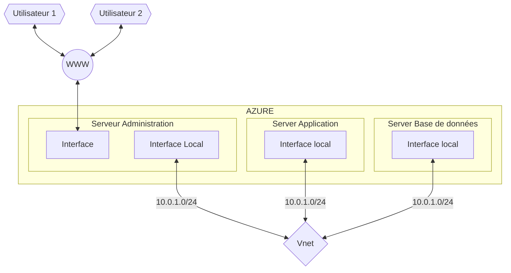

# 1.Plan du réseau

# Liste des ressources

* 1 Réseau virtuel
* 4 interfaces réseau
* 1 adresse IP publique
* Gateway
* 3 Machines virtuelles
* Domain App services
* Compte de stockage

# Liste des tâches

1.Création du réseau virtuelle
2.Création des interfaces réseaux
3.Attributions des adresses IP privés.
4.Création d'une IP publiques
5.Création et configuration de la machine virtuelle Admnin
6.Création et configuration de la machine virtuelle du serveur d'application
7.Création de machine virtuelle de la base de donnée
8.Création de la passerelle
9.Attribution des cartes réseaux sur les VM respectives
10.Installer sur le serveur d'application les outils nécessaire au bon fonctionnement de nextcloud (PHP,APACHE...)

| Serveur Admin | serveur Application | Seveur BDD |
|---|---|---|
| SSH | SSH | SSH |
|  | PHP | MariaDB |
|  | nginx |  |
|  | Nextcloud |  |
