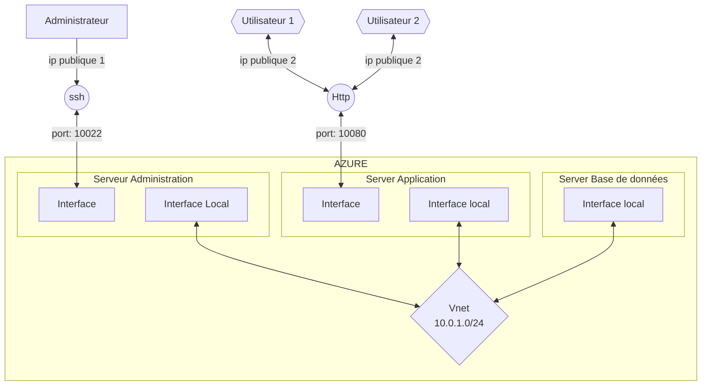

# 1.Plan du réseau

# Liste des ressources

* 1 Réseau virtuel
* 5 interfaces réseaux
* 2 adresse IP publique
* 2 Gateways
* 3 Machines virtuelles
    * bdd : E2s_V3
    * app : F2s_v2
    * admin : DS2_V2
* Domain App services
* Compte de stockage

# Liste des tâches

1. Création du réseau virtuelle
2. Création des interfaces réseaux
3. Attributions des adresses IP privés.
4. Création d'une IP publiques
5. Création et configuration de la machine virtuelle Admin
6. Création et configuration de la machine virtuelle du serveur d'application
7. Création de machine virtuelle de la base de données
8. Création de la passerelle
9. Attribution des cartes réseaux sur les VM respectives
10. Installer et configurer les outils nécessaires au bon fonctionnement de nextcloud sur le serveur d'application:

| Serveur Admin | serveur Application | Seveur BDD |
|---|---|---|
| SSH | SSH | SSH |
|  | PHP | MariaDB |
|  | nginx |  |
|  | Nextcloud |  |

11. Configurer IpTable pour router les connexions des serveurs
